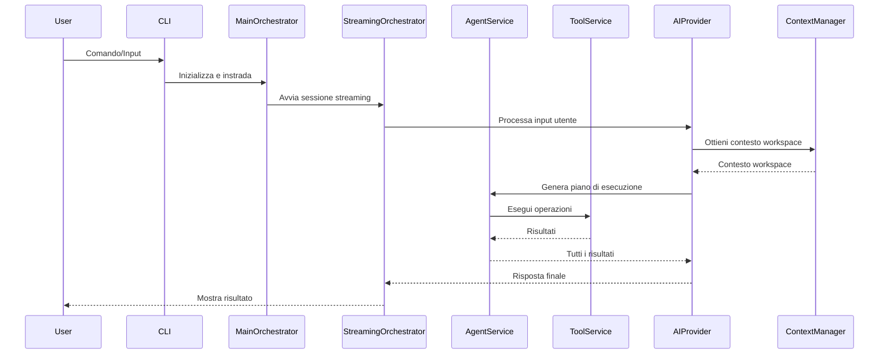
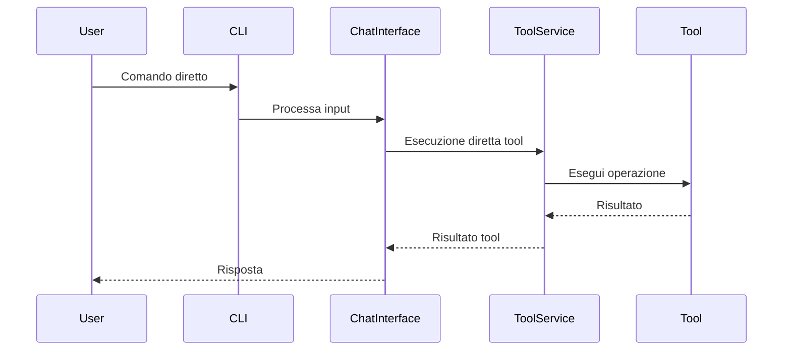

# 🚀 Sistema CLI - Architettura Completa

## 📊 Diagramma dell'Architettura

```mermaid
graph TB
    %% Entry Points
    subgraph "🎯 Entry Points"
        CLI[bin/cli.ts<br/>CLI Entry Point]
        NIKCLI[src/cli/nik-cli.ts<br/>Main CLI Interface]
        UNIFIED[src/cli/unified-cli.ts<br/>Unified Interface]
    end

    %% Main Orchestrator Layer
    subgraph "🎼 Main Orchestrator"
        MAIN[src/cli/main-orchestrator.ts<br/>Main Orchestrator]
        STREAM[src/cli/streaming-orchestrator.ts<br/>Streaming Orchestrator]
        CHAT[src/cli/chat/autonomous-claude-interface.ts<br/>Autonomous Chat Interface]
    end

    %% Services Layer
    subgraph "🔧 Services Layer"
        AGENT_SVC[src/cli/services/agent-service.ts<br/>Agent Service]
        TOOL_SVC[src/cli/services/tool-service.ts<br/>Tool Service]
        PLANNING_SVC[src/cli/services/planning-service.ts<br/>Planning Service]
        LSP_SVC[src/cli/services/lsp-service.ts<br/>LSP Service]
        ORCHESTRATOR_SVC[src/cli/services/orchestrator-service.ts<br/>Orchestrator Service]
    end

    %% AI Providers Layer
    subgraph "🧠 AI Providers"
        ADVANCED_AI[src/cli/ai/advanced-ai-provider.ts<br/>Advanced AI Provider]
        MODERN_AI[src/cli/ai/modern-ai-provider.ts<br/>Modern AI Provider]
        MODEL_PROVIDER[src/cli/ai/model-provider.ts<br/>Model Provider]
        AI_CALL_MGR[src/cli/ai/ai-call-manager.ts<br/>AI Call Manager]
    end

    %% Agent System
    subgraph "🤖 Multi-Agent System"
        AGENT_MGR[src/cli/automation/agents/agent-manager.ts<br/>Agent Manager]
        AGENT_ROUTER[src/cli/automation/agents/agent-router.ts<br/>Agent Router]
        AGENT_FACTORY[src/cli/core/agent-factory.ts<br/>Agent Factory]

        subgraph "Specialized Agents"
            BACKEND[Backend Agent<br/>backend-agent.ts]
            FRONTEND[Frontend Agent<br/>frontend-agent.ts]
            CODING[Coding Agent<br/>coding-agent.ts]
            REVIEW[Code Review Agent<br/>code-review-agent.ts]
            DEVOPS[DevOps Agent<br/>devops-agent.ts]
            UNIVERSAL[Universal Agent<br/>universal-agent.ts]
            AUTONOMOUS[Autonomous Coder<br/>autonomous-coder.ts]
            REACT[React Agent<br/>react-agent.ts]
            SYSTEM_ADMIN[System Admin Agent<br/>system-admin-agent.ts]
        end

        EVENT_BUS[src/cli/automation/agents/event-bus.ts<br/>Event Bus]
        AUTONOMOUS_ORCH[src/cli/automation/agents/autonomous-orchestrator.ts<br/>Autonomous Orchestrator]
    end

    %% Context & Intelligence
    subgraph "🧩 Context & Intelligence"
        WORKSPACE_CTX[src/cli/context/workspace-context.ts<br/>Workspace Context]
        CONTEXT_AWARE_RAG[src/cli/context/context-aware-rag.ts<br/>Context-Aware RAG]
        WORKSPACE_RAG[src/cli/context/workspace-rag.ts<br/>Workspace RAG]
        CONTEXT_MGR[src/cli/core/context-manager.ts<br/>Context Manager]
        CONTEXT_ENHANCER[src/cli/core/context-enhancer.ts<br/>Context Enhancer]
    end

    %% Planning System
    subgraph "📋 Planning & Execution"
        AUTONOMOUS_PLANNER[src/cli/planning/autonomous-planner.ts<br/>Autonomous Planner]
        PLAN_GENERATOR[src/cli/planning/plan-generator.ts<br/>Plan Generator]
        PLAN_EXECUTOR[src/cli/planning/plan-executor.ts<br/>Plan Executor]
        PLANNING_MGR[src/cli/planning/planning-manager.ts<br/>Planning Manager]
        TODO_MGR[src/cli/automation/agents/agent-todo-manager.ts<br/>Agent Todo Manager]
        WORKFLOW_ORCH[src/cli/automation/workflow-orchestrator.ts<br/>Workflow Orchestrator]
    end

    %% Tools System
    subgraph "🛠️ Tools System"
        TOOL_REG[src/cli/tools/tool-registry.ts<br/>Tool Registry]
        SECURE_TOOLS[src/cli/tools/secure-tools-registry.ts<br/>Secure Tools Registry]

        subgraph "File Tools"
            READ_TOOL[Read File Tool<br/>read-file-tool.ts]
            WRITE_TOOL[Write File Tool<br/>write-file-tool.ts]
            EDIT_TOOL[Edit Tool<br/>edit-tool.ts]
            FIND_TOOL[Find Files Tool<br/>find-files-tool.ts]
            MULTI_EDIT[Multi-Edit Tool<br/>multi-edit-tool.ts]
        end

        subgraph "System Tools"
            BASH_TOOL[Bash Tool<br/>bash-tool.ts]
            COMMAND_TOOL[Run Command Tool<br/>run-command-tool.ts]
            GREP_TOOL[Grep Tool<br/>grep-tool.ts]
            LIST_TOOL[List Tool<br/>list-tool.ts]
        end

        TOOLS_MGR[src/cli/tools/tools-manager.ts<br/>Tools Manager]
    end

    %% Core Management
    subgraph "⚙️ Core Management"
        CONFIG_MGR[src/cli/core/config-manager.ts<br/>Config Manager]
        LOGGER[src/cli/core/logger.ts<br/>Logger]
        SESSION_MGR[src/cli/persistence/session-manager.ts<br/>Session Manager]
        GUIDANCE_MGR[src/cli/core/guidance-manager.ts<br/>Guidance Manager]
        EXECUTION_POLICY[src/cli/policies/execution-policy.ts<br/>Execution Policy]
    end

    %% Performance & Caching
    subgraph "⚡ Performance & Caching"
        TOKEN_CACHE[src/cli/core/token-cache.ts<br/>Token Cache]
        COMPLETION_CACHE[src/cli/core/completion-protocol-cache.ts<br/>Completion Protocol Cache]
        SMART_CACHE[src/cli/core/smart-cache-manager.ts<br/>Smart Cache Manager]
        PERFORMANCE_OPT[src/cli/core/performance-optimizer.ts<br/>Performance Optimizer]
    end

    %% UI Components
    subgraph "🎨 UI Components"
        ADVANCED_UI[src/cli/ui/advanced-cli-ui.ts<br/>Advanced CLI UI]
        APPROVAL_SYS[src/cli/ui/approval-system.ts<br/>Approval System]
        DIFF_MGR[src/cli/ui/diff-manager.ts<br/>Diff Manager]
        DIFF_VIEWER[src/cli/ui/diff-viewer.ts<br/>Diff Viewer]
    end

    %% External Integrations
    subgraph "🔌 External Integrations"
        MCP_CLIENT[src/cli/core/mcp-client.ts<br/>MCP Client]
        LSP_MGR[src/cli/lsp/lsp-manager.ts<br/>LSP Manager]
        LSP_CLIENT[src/cli/lsp/lsp-client.ts<br/>LSP Client]
        LANGUAGE_DETECT[src/cli/lsp/language-detection.ts<br/>Language Detection]
    end

    %% Chat & Communication
    subgraph "💬 Chat & Communication"
        CHAT_MGR[src/cli/chat/chat-manager.ts<br/>Chat Manager]
        CHAT_ORCH[src/cli/chat/chat-orchestrator.ts<br/>Chat Orchestrator]
        SLASH_COMMANDS[src/cli/chat/nik-cli-commands.ts<br/>Slash Commands]
        STREAM_MGR[src/cli/chat/stream-manager.ts<br/>Stream Manager]
    end

    %% Analytics & Monitoring
    subgraph "📊 Analytics & Monitoring"
        ANALYTICS_MGR[src/cli/core/analytics-manager.ts<br/>Analytics Manager]
        AGENT_STREAM[src/cli/core/agent-stream.ts<br/>Agent Stream]
        AGENT_TODO_MGR[src/cli/core/agent-todo-manager.ts<br/>Agent Todo Manager]
    end

    %% Advanced Features
    subgraph "🚀 Advanced Features"
        ADVANCED_TOOLS[src/cli/core/advanced-tools.ts<br/>Advanced Tools]
        DOC_LIBRARY[src/cli/core/documentation-library.ts<br/>Documentation Library]
        IDE_CONTEXT[src/cli/core/ide-context-enricher.ts<br/>IDE Context Enricher]
        WEB_SEARCH[src/cli/core/web-search-provider.ts<br/>Web Search Provider]
    end

    %% Data Flow Connections
    CLI --> MAIN
    NIKCLI --> MAIN
    UNIFIED --> MAIN

    MAIN --> STREAM
    MAIN --> CHAT
    MAIN --> CONFIG_MGR
    MAIN --> LOGGER

    STREAM --> AGENT_SVC
    STREAM --> TOOL_SVC
    STREAM --> PLANNING_SVC
    STREAM --> LSP_SVC

    CHAT --> ADVANCED_AI
    CHAT --> MODERN_AI
    CHAT --> CHAT_MGR
    CHAT --> STREAM_MGR

    %% AI Providers Connections
    ADVANCED_AI --> MODEL_PROVIDER
    MODERN_AI --> MODEL_PROVIDER
    AI_CALL_MGR --> ADVANCED_AI
    AI_CALL_MGR --> MODERN_AI

    %% Agent System Connections
    AGENT_SVC --> AGENT_MGR
    AGENT_MGR --> AGENT_ROUTER
    AGENT_MGR --> AGENT_FACTORY
    AGENT_ROUTER --> BACKEND
    AGENT_ROUTER --> FRONTEND
    AGENT_ROUTER --> CODING
    AGENT_ROUTER --> REVIEW
    AGENT_ROUTER --> DEVOPS
    AGENT_ROUTER --> UNIVERSAL
    AGENT_ROUTER --> AUTONOMOUS
    AGENT_ROUTER --> REACT
    AGENT_ROUTER --> SYSTEM_ADMIN

    EVENT_BUS --> AGENT_MGR
    AUTONOMOUS_ORCH --> AGENT_MGR

    %% Context Connections
    AGENT_MGR --> WORKSPACE_CTX
    WORKSPACE_CTX --> CONTEXT_AWARE_RAG
    CONTEXT_AWARE_RAG --> WORKSPACE_RAG
    CONTEXT_MGR --> WORKSPACE_CTX
    CONTEXT_ENHANCER --> CONTEXT_MGR

    %% Planning Connections
    PLANNING_SVC --> AUTONOMOUS_PLANNER
    PLANNING_SVC --> PLAN_GENERATOR
    PLAN_GENERATOR --> PLAN_EXECUTOR
    PLAN_EXECUTOR --> TODO_MGR
    WORKFLOW_ORCH --> AUTONOMOUS_ORCH

    %% Tools Connections
    TOOL_SVC --> TOOL_REG
    TOOL_REG --> SECURE_TOOLS
    SECURE_TOOLS --> READ_TOOL
    SECURE_TOOLS --> WRITE_TOOL
    SECURE_TOOLS --> EDIT_TOOL
    SECURE_TOOLS --> FIND_TOOL
    SECURE_TOOLS --> MULTI_EDIT
    SECURE_TOOLS --> BASH_TOOL
    SECURE_TOOLS --> COMMAND_TOOL
    SECURE_TOOLS --> GREP_TOOL
    SECURE_TOOLS --> LIST_TOOL
    TOOLS_MGR --> TOOL_REG

    %% Core Management Connections
    MAIN --> CONFIG_MGR
    MAIN --> LOGGER
    MAIN --> SESSION_MGR
    MAIN --> GUIDANCE_MGR
    MAIN --> EXECUTION_POLICY

    %% Performance Connections
    ADVANCED_AI --> TOKEN_CACHE
    ADVANCED_AI --> COMPLETION_CACHE
    SMART_CACHE --> TOKEN_CACHE
    PERFORMANCE_OPT --> SMART_CACHE

    %% UI Connections
    CHAT --> ADVANCED_UI
    ADVANCED_UI --> APPROVAL_SYS
    APPROVAL_SYS --> DIFF_MGR
    DIFF_MGR --> DIFF_VIEWER

    %% External Integrations
    MAIN --> MCP_CLIENT
    LSP_SVC --> LSP_MGR
    LSP_MGR --> LSP_CLIENT
    LSP_CLIENT --> LANGUAGE_DETECT

    %% Chat Connections
    CHAT --> CHAT_MGR
    CHAT --> CHAT_ORCH
    CHAT_ORCH --> SLASH_COMMANDS
    STREAM_MGR --> CHAT_ORCH

    %% Analytics Connections
    ANALYTICS_MGR --> AGENT_STREAM
    AGENT_STREAM --> AGENT_TODO_MGR

    %% Advanced Features Connections
    ADVANCED_TOOLS --> DOC_LIBRARY
    IDE_CONTEXT --> ADVANCED_TOOLS
    WEB_SEARCH --> ADVANCED_TOOLS

    %% Styling
    classDef entryLayer fill:#e1f5fe,stroke:#01579b,stroke-width:2px
    classDef orchestratorLayer fill:#f3e5f5,stroke:#4a148c,stroke-width:2px
    classDef servicesLayer fill:#e8f5e8,stroke:#1b5e20,stroke-width:2px
    classDef aiLayer fill:#fff3e0,stroke:#e65100,stroke-width:2px
    classDef agentLayer fill:#fce4ec,stroke:#880e4f,stroke-width:2px
    classDef contextLayer fill:#f1f8e9,stroke:#33691e,stroke-width:2px
    classDef planningLayer fill:#fff8e1,stroke:#f57f17,stroke-width:2px
    classDef toolsLayer fill:#f5f5f5,stroke:#424242,stroke-width:2px
    classDef coreLayer fill:#e0f2f1,stroke:#004d40,stroke-width:2px
    classDef performanceLayer fill:#fafafa,stroke:#212121,stroke-width:2px
    classDef uiLayer fill:#f3e5f5,stroke:#4a148c,stroke-width:2px
    classDef externalLayer fill:#e8eaf6,stroke:#1a237e,stroke-width:2px
    classDef chatLayer fill:#e0f7fa,stroke:#006064,stroke-width:2px
    classDef analyticsLayer fill:#f9fbe7,stroke:#827717,stroke-width:2px
    classDef advancedLayer fill:#fff3e0,stroke:#e65100,stroke-width:2px

    class CLI,NIKCLI,UNIFIED entryLayer
    class MAIN,STREAM,CHAT orchestratorLayer
    class AGENT_SVC,TOOL_SVC,PLANNING_SVC,LSP_SVC,ORCHESTRATOR_SVC servicesLayer
    class ADVANCED_AI,MODERN_AI,MODEL_PROVIDER,AI_CALL_MGR aiLayer
    class AGENT_MGR,AGENT_ROUTER,AGENT_FACTORY,BACKEND,FRONTEND,CODING,REVIEW,DEVOPS,UNIVERSAL,AUTONOMOUS,REACT,SYSTEM_ADMIN,EVENT_BUS,AUTONOMOUS_ORCH agentLayer
    class WORKSPACE_CTX,CONTEXT_AWARE_RAG,WORKSPACE_RAG,CONTEXT_MGR,CONTEXT_ENHANCER contextLayer
    class AUTONOMOUS_PLANNER,PLAN_GENERATOR,PLAN_EXECUTOR,PLANNING_MGR,TODO_MGR,WORKFLOW_ORCH planningLayer
    class TOOL_REG,SECURE_TOOLS,READ_TOOL,WRITE_TOOL,EDIT_TOOL,FIND_TOOL,MULTI_EDIT,BASH_TOOL,COMMAND_TOOL,GREP_TOOL,LIST_TOOL,TOOLS_MGR toolsLayer
    class CONFIG_MGR,LOGGER,SESSION_MGR,GUIDANCE_MGR,EXECUTION_POLICY coreLayer
    class TOKEN_CACHE,COMPLETION_CACHE,SMART_CACHE,PERFORMANCE_OPT performanceLayer
    class ADVANCED_UI,APPROVAL_SYS,DIFF_MGR,DIFF_VIEWER uiLayer
    class MCP_CLIENT,LSP_MGR,LSP_CLIENT,LANGUAGE_DETECT externalLayer
    class CHAT_MGR,CHAT_ORCH,SLASH_COMMANDS,STREAM_MGR chatLayer
    class ANALYTICS_MGR,AGENT_STREAM,AGENT_TODO_MGR analyticsLayer
    class ADVANCED_TOOLS,DOC_LIBRARY,IDE_CONTEXT,WEB_SEARCH advancedLayer
```



## 🔄 Flussi di Esecuzione Principali

### 1. **Modalità Autonoma**



### 2. **Modalità Manuale**



## 🎯 Caratteristiche Principali

### **🤖 Multi-Agent Architecture**

- **Agenti Specializzati**: Backend, Frontend, Coding, Review, DevOps, Universal, Autonomous
- **Agent Manager**: Gestione lifecycle degli agenti
- **Agent Router**: Routing intelligente dei task
- **Event Bus**: Sistema di messaging tra agenti

### **🧠 AI-Powered**

- **Advanced AI Provider**: Provider AI avanzato con capacità autonome
- **Modern AI Provider**: Provider AI moderno con tool integration
- **Model Provider**: Gestione dei modelli AI
- **AI Call Manager**: Orchestrazione delle chiamate AI

### **🔒 Security-First**

- **Execution Policy**: Politiche di sicurezza ed esecuzione
- **Secure Tools Registry**: Sistema di policy e approvazioni
- **Approval System**: Sistema di approvazioni per operazioni critiche

### **📊 Context-Aware**

- **Workspace Context**: Analisi e gestione del contesto workspace
- **Context-Aware RAG**: Sistema RAG consapevole del contesto
- **Context Manager**: Gestione centralizzata del contesto

### **⚡ High Performance**

- **Token Cache**: Cache per token AI
- **Completion Protocol Cache**: Cache per completamenti
- **Smart Cache Manager**: Gestione cache intelligente
- **Performance Optimizer**: Ottimizzazioni performance

### **🔄 Autonomous**

- **Autonomous Orchestrator**: Orchestrazione autonoma multi-agente
- **Autonomous Planner**: Pianificazione autonoma dei task
- **Plan Executor**: Esecuzione dei piani
- **Workflow Orchestrator**: Orchestrazione di workflow complessi

### **🛠️ Extensible**

- **Tool Registry**: Sistema modulare e estensibile
- **Agent Factory**: Creazione dinamica di agenti
- **Module Manager**: Gestione moduli dinamici
- **Service Layer**: Architettura a servizi

## 📁 Struttura dei File Principali

```
src/cli/
├── main-orchestrator.ts          # Orchestratore principale
├── streaming-orchestrator.ts     # Orchestrazione streaming
├── unified-cli.ts               # Interfaccia unificata
├── nik-cli.ts                   # CLI principale
│
├── ai/                          # Provider AI
│   ├── advanced-ai-provider.ts
│   ├── modern-ai-provider.ts
│   ├── model-provider.ts
│   └── ai-call-manager.ts
│
├── automation/agents/           # Sistema multi-agente
│   ├── agent-manager.ts
│   ├── agent-router.ts
│   ├── base-agent.ts
│   ├── backend-agent.ts
│   ├── frontend-agent.ts
│   ├── coding-agent.ts
│   ├── universal-agent.ts
│   └── autonomous-coder.ts
│
├── services/                    # Layer servizi
│   ├── agent-service.ts
│   ├── tool-service.ts
│   ├── planning-service.ts
│   └── lsp-service.ts
│
├── tools/                       # Sistema tools
│   ├── tool-registry.ts
│   ├── secure-tools-registry.ts
│   ├── read-file-tool.ts
│   ├── write-file-tool.ts
│   └── run-command-tool.ts
│
├── context/                     # Sistema contesto
│   ├── workspace-context.ts
│   ├── context-aware-rag.ts
│   └── workspace-rag.ts
│
├── planning/                    # Sistema pianificazione
│   ├── autonomous-planner.ts
│   ├── plan-generator.ts
│   └── plan-executor.ts
│
├── core/                        # Componenti core
│   ├── config-manager.ts
│   ├── logger.ts
│   ├── context-manager.ts
│   └── token-cache.ts
│
├── ui/                          # Componenti UI
│   ├── advanced-cli-ui.ts
│   ├── approval-system.ts
│   └── diff-manager.ts
│
└── chat/                        # Sistema chat
    ├── autonomous-claude-interface.ts
    ├── chat-manager.ts
    └── nik-cli-commands.ts
```

## 🚀 Tecnologie e Dipendenze

### **Core Technologies**

- **TypeScript**: Linguaggio principale
- **Node.js**: Runtime environment
- **EventEmitter**: Sistema di eventi
- **Readline**: Interfaccia CLI

### **AI & ML**

- **OpenAI API**: GPT models
- **Anthropic API**: Claude models
- **Google AI**: Gemini models
- **Embedding Models**: Text embeddings

### **Development Tools**

- **LSP**: Language Server Protocol
- **MCP**: Model Context Protocol
- **Git Integration**: Operazioni Git
- **Docker Integration**: Containerizzazione

### **Performance & Caching**

- **Token Management**: Gestione token AI
- **Completion Caching**: Cache completamenti
- **Smart Caching**: Cache intelligente
- **Streaming**: Streaming in tempo reale

## 🎨 Interfaccia Utente

### **Advanced CLI UI**

- **Structured Panels**: Pannelli strutturati per informazioni
- **Real-time Updates**: Aggiornamenti in tempo reale
- **Progress Indicators**: Indicatori di progresso
- **Status Display**: Visualizzazione stato sistema

### **Approval System**

- **Risk Assessment**: Valutazione rischi
- **Manual Approval**: Approvazioni manuali
- **Auto-approval Rules**: Regole auto-approvazione
- **Safety Checks**: Controlli di sicurezza

### **Diff Management**

- **File Diffs**: Differenze file
- **Interactive Review**: Revisione interattiva
- **Batch Operations**: Operazioni batch
- **Version Control**: Controllo versioni

## 🔧 Configurazione e Personalizzazione

### **Config Manager**

- **Model Configuration**: Configurazione modelli AI
- **API Keys Management**: Gestione chiavi API
- **Tool Settings**: Impostazioni tools
- **Agent Configuration**: Configurazione agenti

### **Execution Policy**

- **Security Levels**: Livelli di sicurezza
- **Approval Rules**: Regole di approvazione
- **Risk Assessment**: Valutazione rischi
- **Safety Checks**: Controlli sicurezza

## 📈 Monitoraggio e Analytics

### **Analytics Manager**

- **Usage Tracking**: Tracciamento utilizzo
- **Performance Metrics**: Metriche performance
- **Error Tracking**: Tracciamento errori
- **User Behavior**: Comportamento utente

### **Agent Stream**

- **Real-time Monitoring**: Monitoraggio tempo reale
- **Agent Status**: Stato agenti
- **Task Progress**: Progresso task
- **Performance Metrics**: Metriche performance

---

## 🎯 Conclusione

Il sistema CLI rappresenta una **CLI di nuova generazione** che combina:

- **🤖 AI avanzata** con multiple AI providers
- **🔄 Multi-agent systems** per task specializzati
- **🔒 Sicurezza first** con sistema di policy
- **📊 Context awareness** con RAG system
- **⚡ High performance** con caching ottimizzato
- **🛠️ Estensibilità** con architettura modulare

Il sistema è progettato per essere **completamente autonomo** ma anche **controllabile dall'utente**, offrendo un'esperienza di sviluppo estremamente avanzata e produttiva.
