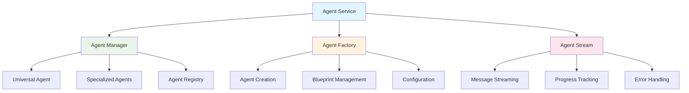
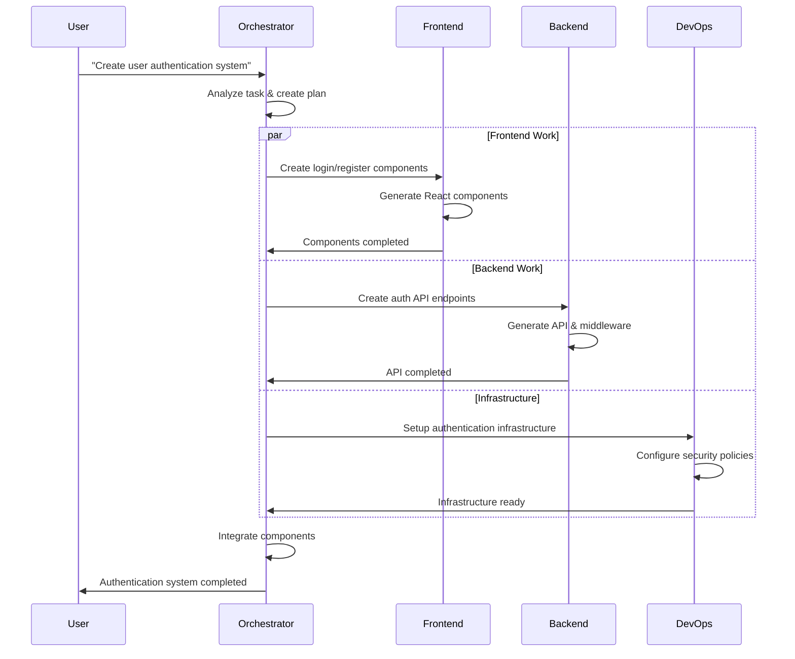

## Agent System Overview

NikCLI's agent system is the core of its autonomous development capabilities. Built on a **service-oriented architecture**, it provides a sophisticated multi-agent environment where specialized AI agents collaborate to handle complex development tasks.

<CardGroup cols={2}>
  <Card title="Universal Agent" icon="robot">
    Single comprehensive agent with full-stack development capabilities
  </Card>
  <Card title="Specialized Agents" icon="users">
    Domain-specific agents for React, Backend, DevOps, and more
  </Card>
  <Card title="Agent Orchestration" icon="workflow">
    Coordinated execution with dependency management
  </Card>
  <Card title="Stream Processing" icon="stream">
    Real-time communication and progress tracking
  </Card>
</CardGroup>

## Architectural Principles

### 1. Service-Oriented Design

The agent system follows a **modular service architecture** where each component has well-defined responsibilities:



### 2. Agent Lifecycle Management

Each agent follows a structured lifecycle with clear phases:

<Steps>
  <Step title="Initialization">
    Agent is created with specific configuration and capabilities
    ```typescript
    const agent = await agentFactory.createAgent({
      type: 'universal',
      permissions: agentPermissions,
      context: workspaceContext
    });
    ```
  </Step>
  
  <Step title="Task Reception">
    Agent receives task with context and requirements
    ```typescript
    const task: AgentTask = {
      id: nanoid(),
      description: "Create authentication system",
      context: projectContext,
      requirements: taskRequirements
    };
    ```
  </Step>
  
  <Step title="Planning & Analysis">
    Agent analyzes task and creates execution plan
    ```typescript
    const plan = await agent.createExecutionPlan(task);
    ```
  </Step>
  
  <Step title="Execution">
    Agent executes plan with real-time progress updates
    ```typescript
    const stream = agent.executeTask(task, plan);
    ```
  </Step>
  
  <Step title="Completion">
    Agent reports results and cleanup
    ```typescript
    const result = await agent.completeTask(taskId);
    ```
  </Step>
</Steps>

### 3. Communication Patterns

Agents communicate through structured message streams:

<Tabs>
  <Tab title="Agent-to-System">
    ```typescript
    interface AgentMessage {
      type: 'progress' | 'result' | 'error' | 'request';
      agentId: string;
      taskId: string;
      payload: any;
      timestamp: number;
    }
    ```
  </Tab>
  
  <Tab title="Inter-Agent">
    ```typescript
    interface InterAgentMessage {
      fromAgent: string;
      toAgent: string;
      type: 'delegation' | 'collaboration' | 'resource_request';
      data: any;
    }
    ```
  </Tab>
  
  <Tab title="User Interaction">
    ```typescript
    interface UserInteraction {
      type: 'approval_request' | 'clarification' | 'progress_update';
      message: string;
      options?: string[];
      required: boolean;
    }
    ```
  </Tab>
</Tabs>

## Core Components

### Agent Manager (`src/cli/core/agent-manager.ts`)

The central orchestrator for all agent operations:

<AccordionGroup>
  <Accordion title="Agent Registry">
    Maintains a registry of all available agents and their capabilities:
    
    ```typescript
    class AgentManager {
      private agents: Map<string, BaseAgent> = new Map();
      private capabilities: Map<string, AgentCapability[]> = new Map();
      
      registerAgent(agent: BaseAgent): void {
        this.agents.set(agent.id, agent);
        this.capabilities.set(agent.id, agent.getCapabilities());
      }
      
      findAgentForTask(task: AgentTask): BaseAgent | null {
        // Intelligence matching algorithm
      }
    }
    ```
  </Accordion>
  
  <Accordion title="Task Distribution">
    Intelligently distributes tasks to the most suitable agents:
    
    ```typescript
    async distributeTask(task: AgentTask): Promise<AgentExecution> {
      const suitableAgents = this.findSuitableAgents(task);
      const bestAgent = this.selectBestAgent(suitableAgents, task);
      
      return await bestAgent.executeTask(task);
    }
    ```
  </Accordion>
  
  <Accordion title="Parallel Execution">
    Coordinates multiple agents working on related tasks:
    
    ```typescript
    async executeParallel(tasks: AgentTask[]): Promise<AgentExecution[]> {
      const executions = tasks.map(task => this.distributeTask(task));
      return await Promise.all(executions);
    }
    ```
  </Accordion>
</AccordionGroup>

### Agent Factory (`src/cli/core/agent-factory.ts`)

Responsible for creating and configuring agent instances:

<AccordionGroup>
  <Accordion title="Agent Creation">
    ```typescript
    class AgentFactory {
      async createAgent(config: AgentConfig): Promise<BaseAgent> {
        const AgentClass = this.getAgentClass(config.type);
        const agent = new AgentClass(config);
        
        await this.configureAgent(agent, config);
        await this.validateAgent(agent);
        
        return agent;
      }
    }
    ```
  </Accordion>
  
  <Accordion title="Blueprint System">
    ```typescript
    interface AgentBlueprint {
      id: string;
      name: string;
      type: AgentType;
      specialization: string;
      capabilities: AgentCapability[];
      configuration: AgentConfig;
      prompts: PromptTemplate[];
    }
    ```
  </Accordion>
  
  <Accordion title="Dynamic Configuration">
    ```typescript
    async configureAgent(agent: BaseAgent, config: AgentConfig): Promise<void> {
      // Apply permissions
      agent.setPermissions(config.permissions);
      
      // Set up tools
      agent.registerTools(config.allowedTools);
      
      // Configure AI provider
      agent.setAIProvider(config.aiProvider);
    }
    ```
  </Accordion>
</AccordionGroup>

### Agent Stream (`src/cli/core/agent-stream.ts`)

Manages real-time communication and progress tracking:

<AccordionGroup>
  <Accordion title="Stream Management">
    ```typescript
    class AgentStream {
      private streams: Map<string, EventEmitter> = new Map();
      
      createStream(agentId: string): EventEmitter {
        const stream = new EventEmitter();
        this.streams.set(agentId, stream);
        return stream;
      }
      
      broadcast(agentId: string, event: string, data: any): void {
        const stream = this.streams.get(agentId);
        stream?.emit(event, data);
      }
    }
    ```
  </Accordion>
  
  <Accordion title="Progress Tracking">
    ```typescript
    interface ProgressUpdate {
      agentId: string;
      taskId: string;
      progress: number; // 0-100
      stage: string;
      message: string;
      timestamp: number;
    }
    ```
  </Accordion>
  
  <Accordion title="Error Handling">
    ```typescript
    handleAgentError(agentId: string, error: AgentError): void {
      this.logError(agentId, error);
      this.notifyUser(error);
      
      if (error.recoverable) {
        this.attemptRecovery(agentId, error);
      } else {
        this.terminateAgent(agentId);
      }
    }
    ```
  </Accordion>
</AccordionGroup>

## Agent Types

### Universal Agent

The **Universal Agent** is NikCLI's flagship agent with comprehensive development capabilities:

```typescript
class UniversalAgent extends BaseAgent {
  capabilities = [
    'full-stack-development',
    'project-analysis',
    'code-generation',
    'refactoring',
    'testing',
    'documentation',
    'deployment',
    'debugging'
  ];
  
  async executeTask(task: AgentTask): Promise<AgentExecution> {
    // Analyze task complexity
    const analysis = await this.analyzeTask(task);
    
    // Create execution plan
    const plan = await this.createExecutionPlan(task, analysis);
    
    // Execute with real-time updates
    return await this.executePlan(plan);
  }
}
```

**Capabilities:**
- **Frontend Development**: React, Vue, Angular components and applications
- **Backend Development**: APIs, databases, server-side logic
- **DevOps Operations**: CI/CD, containerization, deployment
- **Code Analysis**: Refactoring, optimization, debugging
- **Testing**: Unit tests, integration tests, E2E tests
- **Documentation**: Code comments, README files, API docs

### Specialized Agents

<Tabs>
  <Tab title="React Agent">
    ```typescript
    class ReactAgent extends BaseAgent {
      specialization = 'React Development';
      
      capabilities = [
        'component-creation',
        'hook-development',
        'state-management',
        'styling-solutions',
        'performance-optimization'
      ];
      
      async createComponent(spec: ComponentSpec): Promise<ReactComponent> {
        // React-specific component generation
      }
    }
    ```
  </Tab>
  
  <Tab title="Backend Agent">
    ```typescript
    class BackendAgent extends BaseAgent {
      specialization = 'Backend Development';
      
      capabilities = [
        'api-development',
        'database-design',
        'authentication',
        'middleware-creation',
        'performance-optimization'
      ];
      
      async createAPI(spec: APISpec): Promise<APIImplementation> {
        // Backend-specific API generation
      }
    }
    ```
  </Tab>
  
  <Tab title="DevOps Agent">
    ```typescript
    class DevOpsAgent extends BaseAgent {
      specialization = 'DevOps and Infrastructure';
      
      capabilities = [
        'ci-cd-pipelines',
        'containerization',
        'infrastructure-as-code',
        'monitoring-setup',
        'deployment-automation'
      ];
      
      async setupCICD(config: CICDConfig): Promise<Pipeline> {
        // DevOps-specific pipeline creation
      }
    }
    ```
  </Tab>
</Tabs>

## Agent Orchestration

### Multi-Agent Coordination

NikCLI's orchestration system coordinates multiple agents for complex tasks:



### Task Decomposition

The orchestrator breaks complex tasks into manageable subtasks:

<AccordionGroup>
  <Accordion title="Automatic Decomposition">
    ```typescript
    async decomposeTask(task: AgentTask): Promise<SubTask[]> {
      const analysis = await this.analyzeComplexity(task);
      
      if (analysis.complexity > COMPLEXITY_THRESHOLD) {
        return await this.createSubTasks(task, analysis);
      }
      
      return [task]; // Simple task, no decomposition needed
    }
    ```
  </Accordion>
  
  <Accordion title="Dependency Resolution">
    ```typescript
    interface TaskDependency {
      taskId: string;
      dependsOn: string[];
      canParallelize: boolean;
      priority: number;
    }
    
    async resolveDependencies(tasks: SubTask[]): Promise<ExecutionOrder> {
      const dependencyGraph = this.buildDependencyGraph(tasks);
      return this.topologicalSort(dependencyGraph);
    }
    ```
  </Accordion>
  
  <Accordion title="Resource Allocation">
    ```typescript
    async allocateResources(tasks: SubTask[]): Promise<ResourceAllocation> {
      const availableAgents = this.getAvailableAgents();
      const resourceRequirements = this.calculateRequirements(tasks);
      
      return this.optimizeAllocation(availableAgents, resourceRequirements);
    }
    ```
  </Accordion>
</AccordionGroup>

## Security and Permissions

### Permission System

Each agent operates within a defined permission framework:

```typescript
interface AgentPermissions {
  fileOperations: {
    read: string[]; // Allowed paths
    write: string[];
    execute: string[];
  };
  
  commandExecution: {
    allowed: string[]; // Allowed commands
    blocked: string[]; // Explicitly blocked
    requireApproval: string[]; // Need user approval
  };
  
  networkAccess: {
    enabled: boolean;
    allowedDomains: string[];
    blockedDomains: string[];
  };
  
  systemAccess: {
    environmentVariables: boolean;
    processManagement: boolean;
    systemConfiguration: boolean;
  };
}
```

### Security Policies

<Tabs>
  <Tab title="Execution Policies">
    ```typescript
    class ExecutionPolicy {
      validateCommand(command: string, agent: BaseAgent): boolean {
        const permissions = agent.getPermissions();
        
        // Check if command is explicitly blocked
        if (permissions.commandExecution.blocked.includes(command)) {
          return false;
        }
        
        // Check if command is in allowed list
        if (!permissions.commandExecution.allowed.includes(command)) {
          return false;
        }
        
        return true;
      }
    }
    ```
  </Tab>
  
  <Tab title="File Access Control">
    ```typescript
    validateFileAccess(
      path: string, 
      operation: 'read' | 'write' | 'execute',
      agent: BaseAgent
    ): boolean {
      const permissions = agent.getPermissions();
      const allowedPaths = permissions.fileOperations[operation];
      
      return allowedPaths.some(allowedPath => 
        this.isPathAllowed(path, allowedPath)
      );
    }
    ```
  </Tab>
  
  <Tab title="Approval Workflows">
    ```typescript
    async requestApproval(
      action: ActionRequest,
      agent: BaseAgent
    ): Promise<boolean> {
      const approvalRequest: ApprovalRequest = {
        agentId: agent.id,
        action: action,
        riskLevel: this.assessRisk(action),
        timestamp: Date.now()
      };
      
      return await this.approvalSystem.requestApproval(approvalRequest);
    }
    ```
  </Tab>
</Tabs>

## Performance Optimization

### Caching and Memoization

Agents use sophisticated caching to improve performance:

<AccordionGroup>
  <Accordion title="Context Caching">
    ```typescript
    class ContextCache {
      private cache = new Map<string, ProjectContext>();
      
      async getContext(projectPath: string): Promise<ProjectContext> {
        if (this.cache.has(projectPath)) {
          return this.cache.get(projectPath)!;
        }
        
        const context = await this.analyzeProject(projectPath);
        this.cache.set(projectPath, context);
        return context;
      }
    }
    ```
  </Accordion>
  
  <Accordion title="Response Caching">
    ```typescript
    class ResponseCache {
      async getCachedResponse(
        prompt: string,
        context: string
      ): Promise<string | null> {
        const cacheKey = this.generateCacheKey(prompt, context);
        return await this.cache.get(cacheKey);
      }
    }
    ```
  </Accordion>
  
  <Accordion title="Incremental Updates">
    ```typescript
    async updateContext(
      projectPath: string,
      changes: FileChange[]
    ): Promise<void> {
      const existingContext = await this.getContext(projectPath);
      const updatedContext = this.applyIncrementalChanges(
        existingContext,
        changes
      );
      
      this.cache.set(projectPath, updatedContext);
    }
    ```
  </Accordion>
</AccordionGroup>

## Error Handling and Recovery

### Resilient Agent Operations

The agent system includes comprehensive error handling:

<AccordionGroup>
  <Accordion title="Error Classification">
    ```typescript
    enum ErrorType {
      RECOVERABLE = 'recoverable',
      FATAL = 'fatal',
      USER_ACTION_REQUIRED = 'user_action_required',
      PERMISSION_DENIED = 'permission_denied'
    }
    
    class AgentError extends Error {
      constructor(
        message: string,
        public type: ErrorType,
        public agentId: string,
        public taskId: string,
        public recoveryStrategy?: RecoveryStrategy
      ) {
        super(message);
      }
    }
    ```
  </Accordion>
  
  <Accordion title="Recovery Strategies">
    ```typescript
    interface RecoveryStrategy {
      maxRetries: number;
      backoffStrategy: 'linear' | 'exponential';
      fallbackAgent?: string;
      userNotification: boolean;
    }
    
    async executeWithRecovery(
      agent: BaseAgent,
      task: AgentTask
    ): Promise<AgentExecution> {
      let retries = 0;
      const maxRetries = task.recoveryStrategy?.maxRetries || 3;
      
      while (retries < maxRetries) {
        try {
          return await agent.executeTask(task);
        } catch (error) {
          if (this.shouldRetry(error)) {
            retries++;
            await this.wait(this.calculateBackoff(retries));
          } else {
            throw error;
          }
        }
      }
    }
    ```
  </Accordion>
  
  <Accordion title="Graceful Degradation">
    ```typescript
    async handleAgentFailure(
      failedAgent: BaseAgent,
      task: AgentTask
    ): Promise<void> {
      // Try fallback agent
      const fallbackAgent = this.findFallbackAgent(failedAgent, task);
      if (fallbackAgent) {
        await fallbackAgent.executeTask(task);
        return;
      }
      
      // Graceful degradation
      await this.notifyUserOfFailure(failedAgent, task);
      await this.savePartialProgress(task);
    }
    ```
  </Accordion>
</AccordionGroup>

## Next Steps

<CardGroup cols={2}>
  <Card
    title="Universal Agent"
    icon="robot"
    href="/agent-system/universal-agent"
  >
    Deep dive into the Universal Agent's capabilities
  </Card>
  <Card
    title="Specialized Agents"
    icon="users"
    href="/agent-system/specialized-agents"
  >
    Learn about domain-specific agent implementations
  </Card>
  <Card
    title="Agent Orchestration"
    icon="workflow"
    href="/agent-system/orchestration"
  >
    Master multi-agent coordination and workflows
  </Card>
  <Card
    title="Custom Agents"
    icon="plus"
    href="/agent-system/custom-agents"
  >
    Create your own specialized agents
  </Card>
</CardGroup>

<Tip>
  The agent system is designed to be extensible. You can create custom agents for specific domains or integrate with external tools and services through the MCP (Model Context Protocol) system.
</Tip>