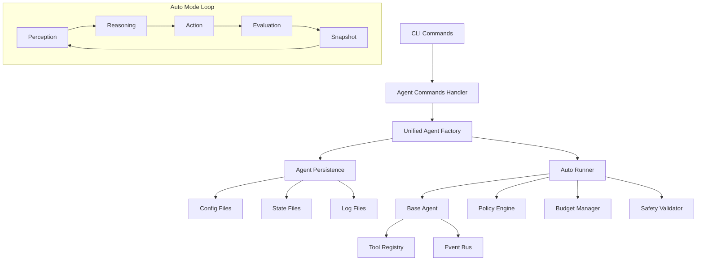

# Agents Auto Mode - Documentazione Completa

## Panoramica

Il sistema **Agents Auto Mode** di NikCLI fornisce un'architettura enterprise-grade per agenti autonomi richiamabili da CLI e componibili tramite factory. Il sistema implementa un ciclo di vita completo degli agenti con persistenza dello stato, policy di sicurezza e limiti di risorse.

## Architettura



## Comandi CLI

### create-agent
Crea un nuovo agente da profilo o configurazione.

```bash
# Da profilo predefinito
create-agent --name demo --profile researcher

# Da file di configurazione
create-agent --name demo --config ./examples/researcher.json

# Con override
create-agent --name demo --profile coder --override.autoMode.maxSteps 100
```

**Opzioni:**
- `--name, -n <name>`: Nome dell'agente (obbligatorio)
- `--profile, -p <profile>`: Profilo dell'agente (researcher, coder, planner, etc.)
- `--config, -c <file>`: File di configurazione
- `--json`: Output in formato JSON
- `--override.<key> <value>`: Override di configurazione
- `--help, -h`: Mostra aiuto

### launch-agent
Avvia un agente in modalità auto o interattiva.

```bash
# Modalità interattiva
launch-agent --name demo

# Modalità auto con limiti
launch-agent --name demo --auto --max-steps 50 --time-limit 30m

# Modalità auto sicura
launch-agent --name demo --auto --safe-tools-only --max-cost 5.0
```

**Opzioni:**
- `--name, -n <name>`: Nome dell'agente (obbligatorio)
- `--auto`: Avvia in modalità auto
- `--max-steps <number>`: Numero massimo di step
- `--max-tokens <number>`: Limite massimo di token
- `--max-cost <number>`: Costo massimo in dollari
- `--time-limit <time>`: Limite di tempo (es: 30m, 2h)
- `--safe-tools-only`: Usa solo strumenti sicuri
- `--allow-write`: Permette operazioni di scrittura
- `--json`: Output in formato JSON
- `--help, -h`: Mostra aiuto

### list-agents
Lista tutti gli agenti con il loro stato.

```bash
# Lista formattata
list-agents

# Lista in JSON
list-agents --json
```

### describe-agent
Mostra informazioni dettagliate su un agente.

```bash
# Informazioni formattate
describe-agent --name demo

# Informazioni in JSON
describe-agent --name demo --json
```

### pause-agent
Pausa un agente in esecuzione.

```bash
pause-agent --name demo
```

### resume-agent
Riprende un agente in pausa.

```bash
# Riprendi in modalità interattiva
resume-agent --name demo

# Riprendi in modalità auto
resume-agent --name demo --auto
```

### kill-agent
Ferma e elimina un agente.

```bash
kill-agent --name demo
```

### factory
Mostra la dashboard della factory o crea agenti da profili.

```bash
# Mostra dashboard
factory

# Crea agente da profilo
factory --profile coder --name demo-coder

# Crea con override
factory --profile researcher --name demo-researcher --overrides '{"autoMode.maxSteps": 100}'
```

## Profili Predefiniti

### Researcher
Specializzato in ricerca e analisi dati.

**Capacità:**
- Ricerca web
- Analisi dati
- Scrittura report
- Valutazione fonti
- Review letteratura
- Analisi trend

**Configurazione predefinita:**
- Autonomia: completamente autonoma
- Scope: workspace
- Stile: sequenziale
- Step massimi: 50
- Token massimi: 15,000
- Costo massimo: $10.0

### Coder
Specializzato in sviluppo software.

**Capacità:**
- Generazione codice
- Code review
- Refactoring
- Testing
- Debugging
- Design architettura
- Ottimizzazione performance

**Configurazione predefinita:**
- Autonomia: completamente autonoma
- Scope: progetto
- Stile: adattivo
- Step massimi: 100
- Token massimi: 20,000
- Costo massimo: $15.0

### Planner
Specializzato in pianificazione strategica.

**Capacità:**
- Pianificazione progetto
- Breakdown task
- Creazione timeline
- Coordinamento risorse
- Valutazione rischi
- Tracking milestone
- Gestione stakeholder

**Configurazione predefinita:**
- Autonomia: semi-autonoma
- Scope: progetto
- Stile: sequenziale
- Step massimi: 30
- Token massimi: 12,000
- Costo massimo: $8.0

### Tester
Specializzato in quality assurance.

**Capacità:**
- Pianificazione test
- Esecuzione test
- Report bug
- Quality assurance

### DevOps
Specializzato in infrastruttura e deployment.

**Capacità:**
- CI/CD
- Containerizzazione
- Infrastructure as Code
- Monitoring
- Automazione

## Modalità Auto

### Ciclo di Esecuzione
Il sistema implementa un ciclo autonomo con 4 fasi:

1. **Percezione**: Analizza lo stato corrente e il contesto
2. **Ragionamento**: Pianifica la prossima azione
3. **Azione**: Esegue l'azione pianificata
4. **Valutazione**: Valuta i risultati e aggiorna la memoria

### Policy di Sicurezza
- **Safe Tools Only**: Usa solo strumenti sicuri
- **Allow Write**: Controlla operazioni di scrittura
- **Rate Limiting**: Limita la frequenza delle operazioni
- **Input Validation**: Valida tutti gli input

### Limiti di Risorse
- **Max Steps**: Numero massimo di step di esecuzione
- **Max Tokens**: Limite di token per le chiamate AI
- **Max Cost**: Costo massimo in dollari
- **Time Limit**: Limite di tempo di esecuzione

### Gestione Errori
- **Retry con Backoff**: Riprova con ritardo esponenziale
- **Graceful Degradation**: Degradazione graduale in caso di errori
- **State Persistence**: Persistenza dello stato per recupero

## Persistenza

### Struttura Directory
```
~/.agent-cli/
├── agents/
│   ├── agent-name/
│   │   ├── config.json
│   │   └── run-id/
│   │       ├── state.json
│   │       ├── logs.ndjson
│   │       └── memory.jsonl
```

### File di Configurazione
- **config.json**: Configurazione dell'agente
- **state.json**: Stato corrente dell'esecuzione
- **logs.ndjson**: Log strutturati in formato NDJSON
- **memory.jsonl**: Memoria dell'agente in formato JSONL

## Esempi di Utilizzo

### Scenario 1: Ricerca Automatica
```bash
# Crea agente researcher
create-agent --name research-bot --profile researcher

# Avvia ricerca automatica
launch-agent --name research-bot --auto --max-steps 20 --time-limit 30m

# Monitora progresso
list-agents

# Pausa se necessario
pause-agent --name research-bot

# Riprendi
resume-agent --name research-bot --auto
```

### Scenario 2: Sviluppo Codice
```bash
# Crea agente coder
create-agent --name code-bot --profile coder

# Avvia sviluppo automatico
launch-agent --name code-bot --auto --allow-write --max-steps 50

# Verifica stato
describe-agent --name code-bot --json
```

### Scenario 3: Pianificazione Progetto
```bash
# Crea agente planner
factory --profile planner --name project-planner

# Avvia pianificazione
launch-agent --name project-planner --auto --safe-tools-only
```

## Configurazione Avanzata

### Schema JSON
Il sistema utilizza JSON Schema per validare le configurazioni:

```json
{
  "$schema": "http://json.schemastore.org/agent-config",
  "name": "agent-name",
  "profile": "researcher|coder|planner|tester|devops|custom",
  "specialization": "string",
  "systemPrompt": "string",
  "capabilities": ["string"],
  "requiredTools": ["string"],
  "personality": {
    "proactive": 0-100,
    "collaborative": 0-100,
    "analytical": 0-100,
    "creative": 0-100
  },
  "autonomyLevel": "supervised|semi-autonomous|fully-autonomous",
  "contextScope": "file|directory|project|workspace",
  "workingStyle": "sequential|parallel|adaptive",
  "autoMode": {
    "enabled": true,
    "maxSteps": 1-1000,
    "maxTokens": 1000-100000,
    "maxCost": 0+,
    "timeLimit": "\\d+[mh]",
    "safeToolsOnly": true,
    "allowWrite": true
  }
}
```

### Variabili d'Ambiente
- `AGENT_CLI_HOME`: Directory base per la persistenza
- `AGENT_CLI_MAX_STEPS`: Step massimi globali
- `AGENT_CLI_MAX_COST`: Costo massimo globale
- `AGENT_CLI_SAFE_MODE`: Modalità sicura globale

## Troubleshooting

### Problemi Comuni

**Agente non trovato:**
```bash
# Verifica esistenza
list-agents

# Ricrea se necessario
create-agent --name demo --profile researcher
```

**Errore di configurazione:**
```bash
# Valida configurazione
describe-agent --name demo --json

# Ricrea con configurazione valida
create-agent --name demo --config ./examples/researcher.json
```

**Agente bloccato:**
```bash
# Pausa e riprendi
pause-agent --name demo
resume-agent --name demo --auto

# Oppure riavvia
kill-agent --name demo
create-agent --name demo --profile researcher
launch-agent --name demo --auto
```

### Log e Debug
I log sono salvati in formato NDJSON per facile parsing:

```bash
# Visualizza log
cat ~/.agent-cli/agents/demo/latest-run/logs.ndjson | jq '.'

# Filtra errori
cat ~/.agent-cli/agents/demo/latest-run/logs.ndjson | jq 'select(.level == "error")'
```

## Best Practices

### Sicurezza
1. Usa sempre `--safe-tools-only` per agenti non fidati
2. Imposta limiti di costo appropriati
3. Monitora l'attività degli agenti
4. Usa `--allow-write` solo quando necessario

### Performance
1. Imposta step massimi appropriati per il task
2. Usa limiti di tempo per evitare loop infiniti
3. Monitora l'uso di token e costi
4. Pausa agenti non utilizzati

### Manutenzione
1. Pulisci regolarmente gli agenti non utilizzati
2. Monitora lo spazio disco per i log
3. Aggiorna le configurazioni quando necessario
4. Backup delle configurazioni importanti

## Roadmap

### Funzionalità Future
- [ ] Supporto per agenti multi-modello
- [ ] Orchestrazione di agenti multipli
- [ ] Integrazione con sistemi esterni
- [ ] Dashboard web per monitoring
- [ ] API REST per integrazione
- [ ] Supporto per plugin personalizzati
- [ ] Metriche e analytics avanzate
- [ ] Backup e restore automatici

### Miglioramenti Pianificati
- [ ] Ottimizzazione performance
- [ ] Migliore gestione errori
- [ ] UI migliorata per comandi
- [ ] Documentazione API
- [ ] Test di integrazione estesi
- [ ] Supporto per più provider AI